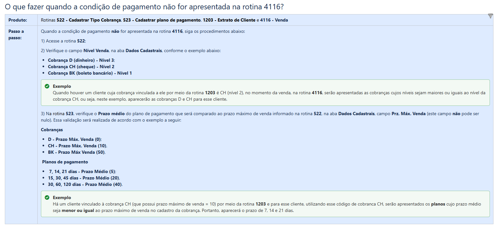
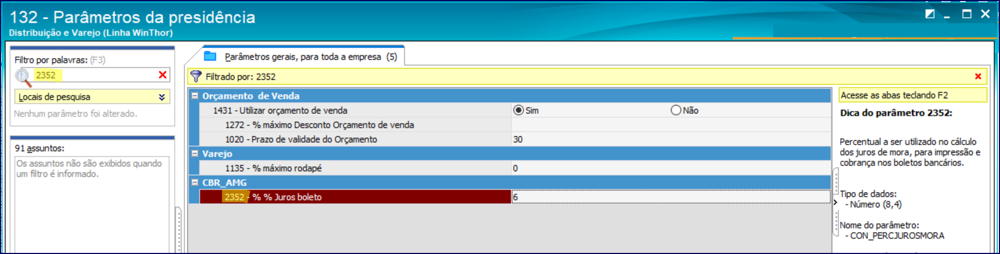
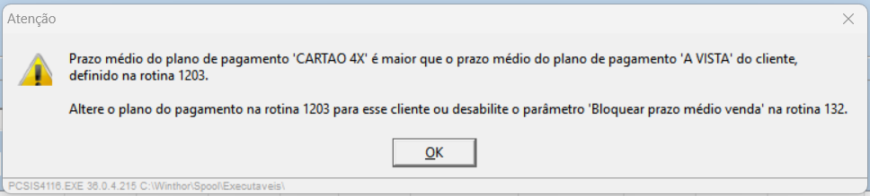
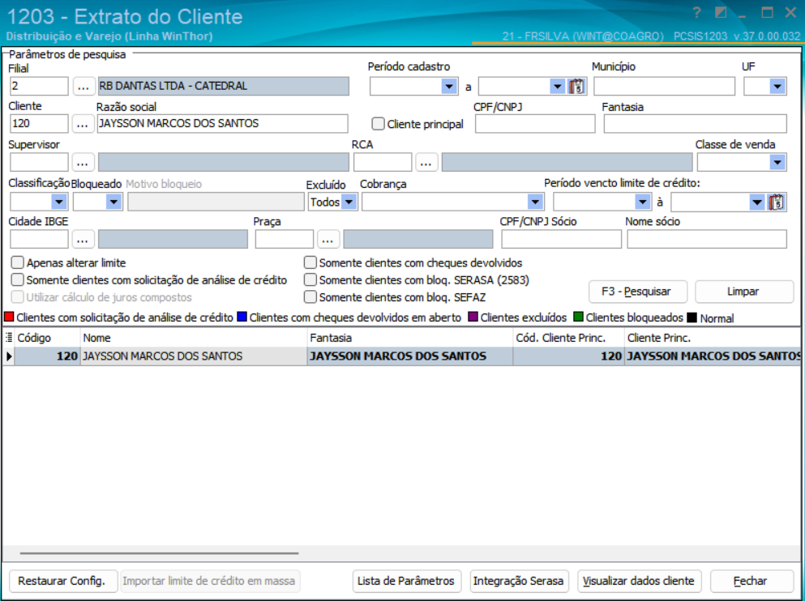
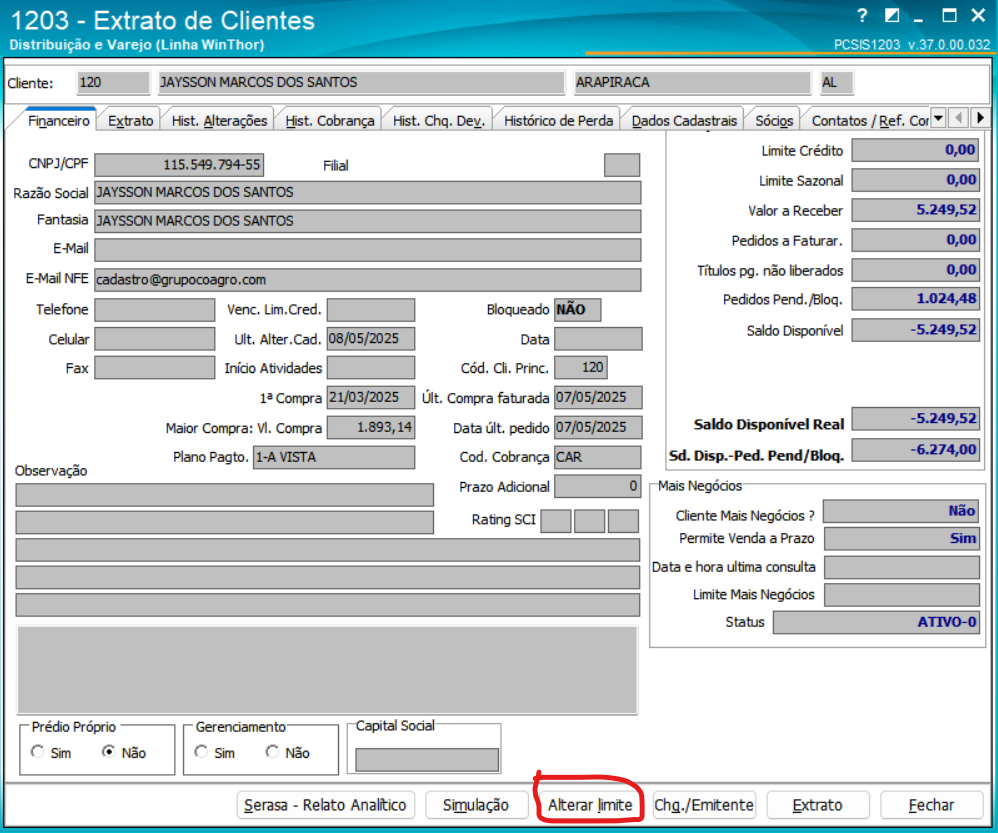
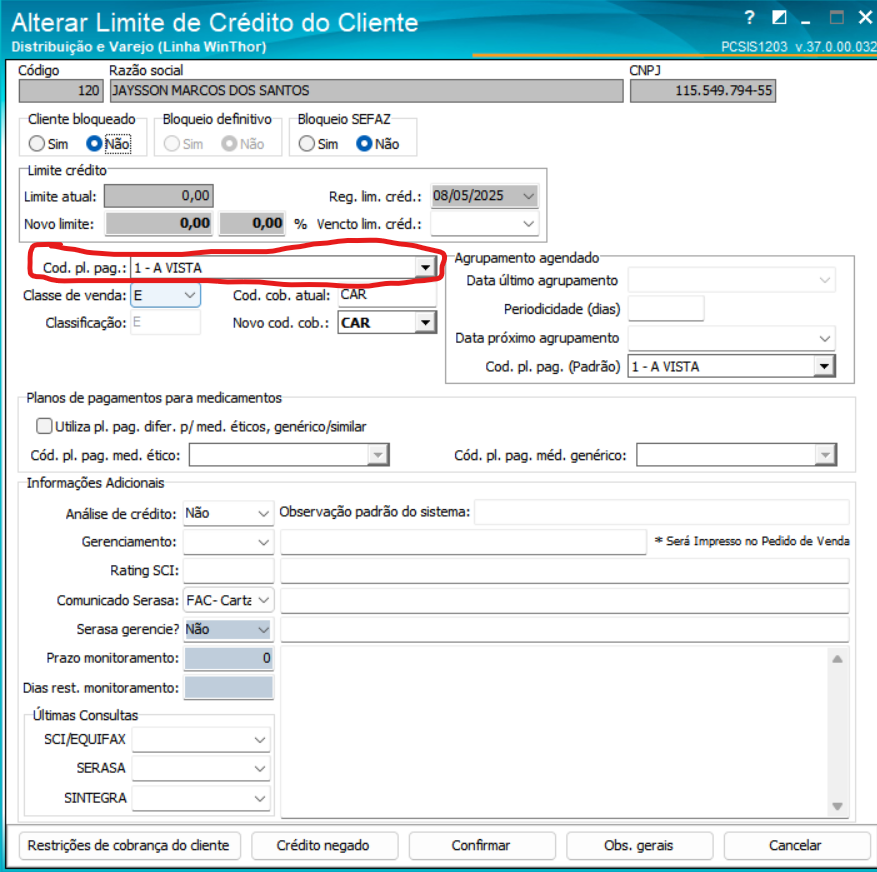
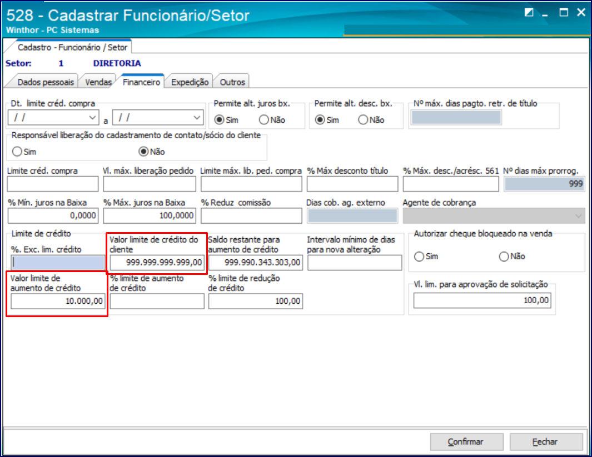

# Manual TOTVS — Alinhamento de Processo

## 📑 Sumário de Rotinas WinThor

- [🧾 Cadastro de Cliente (Rotina 302)](#-cadastro-de-cliente-rotina-302)
- [🧾 Cadastrar Praça (Rotina 572)](#-cadastrar-praça-rotina-572)
- [🧾 Cadastrar Rota (Rotina 520)](#-cadastrar-rota-rotina-520)
- [🧾 Cadastrar Regiões de Venda (Rotina 519)](#-cadastrar-regiões-de-venda-rotina-519)
- [🧾 Cadastrar Grupos (Rotina 3311)](#-cadastrar-grupos-rotina-3311)
- [🧾 Cadastrar Tabela de Preço Utilizada pelo Cliente (Rotina 3314)](#-cadastrar-tabela-de-preço-utilizada-pelo-cliente-rotina-3314)
- [🧾 Alterar Vários Preços de Venda (Rotina 251)](#-alterar-vários-preços-de-venda-rotina-251)
- [🧾 Alterar Condição Comercial do Cliente (Rotina 308)](#-alterar-condição-comercial-do-cliente-rotina-308)
- [🧾 Cadastrar Tipo de Cobrança (Rotina 522)](#-cadastrar-tipo-de-cobrança-rotina-522)
- [🧾 Cadastrar Plano de Pagamento (Rotina 523)](#-cadastrar-plano-de-pagamento-rotina-523)
- [🧾 Cadastrar Moeda (Rotina 527)](#-cadastrar-moeda-rotina-527)
- [🧾 Extrato do Cliente (Rotina 1203)](#-extrato-do-cliente-rotina-1203)
- [🧾 Acionar Importação (Rotina 4147)](#-acionar-importação-rotina-4147)

---

## Dica

- Pequisa no google assim: **wint `A ROTINA QUE DESEJA` site:centraldeatendimento.totvs.com**

Por exemplo:

> wint 4116 site:centraldeatendimento.totvs.com

---

## 🧾 Cadastro de Cliente (Rotina 302)

### 🎯 Finalidade

Permite o cadastro e a manutenção de clientes no sistema WinThor, abrangendo dados cadastrais, fiscais, financeiros e comerciais.

### 🎥 Vídeo Tutorial

[302 - Cadastrar Clientes - Parte I](https://www.youtube.com/watch?v=3tl9q0ue7Q4)

[302 - Cadastrar Clientes - Parte II](https://www.youtube.com/watch?v=yU3XNvuJgWs)

### 📄 Documentação

- [WINT - Como cadastrar cliente na rotina 302](https://centraldeatendimento.totvs.com/hc/pt-br/articles/360026521394-WINT-Como-cadastrar-cliente-na-rotina-302)
- [WINT - 302: Irregularidade fiscal do destinatário](https://centraldeatendimento.totvs.com/hc/pt-br/articles/360025397271-WINT-302-Irregularidade-fiscal-do-destinat%C3%A1rio)
- [WINT - Como realizar alterações no dicionário de dados da rotina 302](https://centraldeatendimento.totvs.com/hc/pt-br/articles/360028020672-WINT-Como-realizar-altera%C3%A7%C3%B5es-no-dicion%C3%A1rio-de-dados-da-rotina-302)
- [WINT - Como adicionar campos na rotina 302](https://centraldeatendimento.totvs.com/hc/pt-br/articles/7465982231831-WINT-Como-adicionar-campos-na-rotina-302)
- [WINT - Como alterar múltiplos registros na rotina 302](https://centraldeatendimento.totvs.com/hc/pt-br/articles/360025513072-WINT-Como-alterar-m%C3%BAltiplos-registros-na-rotina-302)
- [WINT - Como consultar log de alteração na rotina 302](https://centraldeatendimento.totvs.com/hc/pt-br/articles/360028925071-WINT-Como-consultar-log-de-altera%C3%A7%C3%A3o-na-rotina-302)
- [WINT - Como clonar o cadastro de cliente na rotina 302](https://centraldeatendimento.totvs.com/hc/pt-br/articles/360046231214-WINT-Como-clonar-o-cadastro-de-cliente-na-rotina-302)
- [WINT - Como reativar um cliente na rotina 302](https://centraldeatendimento.totvs.com/hc/pt-br/articles/360025809491-WINT-Como-reativar-um-cliente-na-rotina-302)
- [WINT - Como excluir um cliente por meio da rotina 302](https://centraldeatendimento.totvs.com/hc/pt-br/articles/360028021712-WINT-Como-excluir-um-cliente-por-meio-da-rotina-302)
- [WINT - Como inserir Ramo de Atividade e CNAE na rotina 302](https://centraldeatendimento.totvs.com/hc/pt-br/articles/360026648551-WINT-Como-inserir-Ramo-de-Atividade-e-CNAE-na-rotina-302)

### Como transformar um fornecedor em cliente

1. Acesse a transação `302`.
2. Clique nos **três pontinhos** ao lado do campo desejado.
3. Selecione o **fornecedor** que deseja transformar em cliente.
4. Confirme e prossiga com o cadastro.

---

## 🧾 Cadastrar Praça (Rotina 572)

### 🎯 Finalidade

Permite o cadastro e a manutenção de praças no sistema WinThor, organizando clientes por região geográfica (cidade, bairro, região) para:

- Controle comercial de vendas.
- Definição de regras de frete, comissão e campanhas promocionais.
- Emissão de relatórios gerenciais baseados em localização.

### 🎥 Vídeo Tutorial

[572 - Cadastrar Praças](https://www.youtube.com/watch?v=Ux5-D3mIQQE)

### 📄 Documentação

[WINT - Como cadastrar praça pela rotina 572](https://centraldeatendimento.totvs.com/hc/pt-br/articles/360047413633-WINT-Como-cadastrar-pra%C3%A7a-pela-rotina-572)

### 📚 Informações adicionais

Uma praça é um **conjunto de clientes** de uma determinada localidade geográfica. Cada praça **deve obrigatoriamente ser vinculada a uma Rota de Entrega**.

- Um conjunto de praças, organizadas logicamente conforme critérios da empresa, compõe uma **sequência de entrega de mercadorias**.
- A rotina 572 é utilizada para cadastrar essas praças, informando:
  - **Rota**
  - **Região** (Tabela de Preço)
  - **População**
  - **CEP's**
  - **Observações**
- Também permite a **emissão de relatórios** para controle.

#### Campos importantes

- **Código:** Código da praça.
- **Praça:** Nome da cidade ou localidade.
- **Região:** Equivale à Tabela de Preço utilizada na venda.
- **Rota:** Código da rota de entrega associada.
- **Sequência da Rota:** Ordem em que a cidade será atendida na rota.
- **População:** Número de habitantes da praça.
- **Distância:** Distância em km da base até a praça.

> **Observações:**
>
> - O campo **Região** impacta diretamente na formação do preço de venda.
> - A correta definição da **Sequência da Rota** otimiza a logística de entregas.

---

## 🧾 Cadastrar Rota (Rotina 520)

### 🎯 Finalidade

Permite o cadastro e a manutenção de rotas de entrega no sistema WinThor, fundamentais para a organização logística e operacional da empresa. As rotas definem os percursos de entrega, associando clientes, praças e motoristas.

### 🎥 Vídeo Tutorial

[520 - Cadastrar Rotas de Entrega](https://www.youtube.com/watch?v=BP58WgVe7rg)

### 📄 Documentação

[WINT - Como cadastrar uma rota na rotina 520](https://centraldeatendimento.totvs.com/hc/pt-br/articles/360037640334-WINT-Como-cadastrar-uma-rota-na-rotina-520)

### 📚 Informações adicionais

- Uma **rota** é utilizada para organizar a logística de entregas.
- As rotas são compostas por **praças** que, por sua vez, agrupam **clientes**.
- É possível configurar informações como dias de entrega, ajuda de custo, e comissões para motoristas.

#### Campos obrigatórios:

- **Código:** Identificação única da rota.
- **Descrição:** Nome da rota.

#### Campos opcionais (preenchimento conforme necessidade):

- **Rota Rastreada:** Indica se a rota possui rastreamento de entrega.
- **Percentual de Ajuda de Custo ao Motorista**
- **Valor de Ajuda de Custo ao Motorista**
- **Dias de Entrega:** Dias da semana programados para entrega.
- **Tipo de Comissão:** Define a regra de comissão associada à rota.
- **Prazo Estipulado:** Tempo estimado de entrega.
- **Quilometragem da Rota**
- **Número de Diárias:** Quantidade de diárias previstas.
- **Valor da Diária:** Valor a ser pago por diária.
- **Valor Mínimo de Carregamento:** Valor mínimo de venda para efetivar a entrega.
- **Código da Rota Principal:** Para rotas integradas.
- **% de Comissão Motorista 1, 2 e 3**
- **Valor de Comissão Total**
- **Dias de Montagem de Carga**
- **Série e Número de NF-e**
- **Valores de Frete e Alíquotas de ICMS**

> **Observações:**
>
> - No sistema **SIAGRI**, o campo **Ordem** equivale ao **Código** no TOTVS.
> - A **Descrição** corresponde ao **nome da cidade** no cadastro.
> - A correta definição dos campos auxilia a logística e o controle financeiro de entregas.

---

## 🧾 Cadastrar Tabela de Preço Utilizada pelo Cliente (Rotina 3314)

### Finalidade:

Vincular uma tabela de preço específica a um cliente e filial.

A rotina 3314 permite o cadastro e a manutenção das **tabelas de preço** que serão utilizadas pelos **clientes**, facilitando a organização de preços específicos por grupo de cliente, produto ou região.

### 🎥 Vídeo Tutorial

> Nenhum vídeo oficial disponível até o momento.

### 📄 Documentação

[WINT - Como realizar cadastro na rotina 3314](https://centraldeatendimento.totvs.com/hc/pt-br/articles/1500005813862-WINT-Como-realizar-cadastro-na-rotina-3314)
[WINT - Como utilizar o processo da rotina 3314 na venda assistida da rotina 4116](https://centraldeatendimento.totvs.com/hc/pt-br/articles/1500011542362-WINT-Como-utilizar-o-processo-da-rotina-3314-na-venda-assistida-da-rotina-4116)
[WINT - Qual rotina deve ser utilizada para vincular o cliente de uma praça com preço de região de praça diferente](https://centraldeatendimento.totvs.com/hc/pt-br/articles/360026773492-WINT-Qual-rotina-deve-ser-utilizada-para-vincular-o-cliente-de-uma-pra%C3%A7a-com-pre%C3%A7o-de-regi%C3%A3o-de-pra%C3%A7a-diferente)

### 📚 Informações adicionais

- **Integração com a rotina 316**: O cadastro na rotina 3314 habilita o campo **Filial NF** na rotina 316 (Digitação de Pedido de Venda). Se esse campo for preenchido, o sistema utilizará os preços da tabela associada à filial e região informadas. Caso contrário, serão aplicados os preços do cadastro do cliente.
- **Força de Vendas**: Para vendas realizadas pelo Força de Vendas, a validação do campo **Filial NF** será conforme a configuração na rotina 316.

#### Campos obrigatórios

- **Código Cliente**: Identificação única do cliente.
- **Código Filial**: Filial associada ao cliente.
- **Região**: Região geográfica vinculada ao cliente.

> **Observações:**
>
> - O preenchimento desses campos é essencial para garantir a correta aplicação da tabela de preços durante o processo de vendas.
> - A associação correta entre cliente, filial e região facilita o controle e a gestão de preços e descontos aplicados.

---

## 🧾 Cadastrar Regiões de Venda (Rotina 519)

### 🎯 Finalidade

A rotina 519 permite cadastrar e gerenciar as **regiões de venda**, associando as tabelas de preços e possibilitando a gestão de preços específicos para diferentes áreas geográficas ou comerciais.

### 🎥 Vídeo Tutorial

[WINT - Como cadastrar regiões de venda (Rotina 519)](https://www.youtube.com/watch?v=laXcJug-wYQ)

### 📄 Documentação

- [WINT - Como funciona a rotina 519](https://centraldeatendimento.totvs.com/hc/pt-br/articles/360028354251-WINT-Como-funciona-a-rotina-519)
- [WINT - Como gerar a tabela de preço na rotina 519](https://centraldeatendimento.totvs.com/hc/pt-br/articles/360024438472-WINT-Como-gerar-a-tabela-de-pre%C3%A7o-na-rotina-519)
- [WINT - Como cadastrar tabelas de preço para clientes específicos](https://centraldeatendimento.totvs.com/hc/pt-br/articles/360048404153-WINT-Como-cadastrar-tabelas-de-pre%C3%A7o-para-clientes-espec%C3%ADficos)
- [WINT - Como precificar os produtos na rotina 201](https://centraldeatendimento.totvs.com/hc/pt-br/articles/360047675654-WINT-Como-precificar-os-produtos-na-rotina-201)

### 📚 Informações adicionais

- **Região de Venda:** Vincula uma área geográfica com preços de venda específicos para clientes dentro dessa área.
- **Tabelas de Preço:** Podem ser associadas a uma região para aplicação automática nos pedidos.

#### Campos obrigatórios

- **Código**: Identificador único da região de venda.
- **Descrição**: Nome ou descrição da região.

## 🔗 Vinculação de Tabela de Preço ao Cliente no WinThor

Existem duas formas de associar tabelas de preço aos clientes:

1. **Alternativa 1** – Via Praça

   - Cadastre a tabela (região) na **Rotina 519**.
   - Vincule a praça na **Rotina 572**.
   - No cliente, na **Rotina 302**, associe a praça.
   - **Resultado:** o cliente herda a tabela da sua praça.

2. **Alternativa 2** – Direto em Cliente/Filial
   - Use a **Rotina 3314** (Tabela por Cliente e Filial).
   - Vincule a tabela diretamente ao cliente e filial.
   - **Vantagem:** controle individual, sem depender de praça.

### Exemplo de Tabela de Preço por Cliente/Filial

| Filial | Estado                               | Segmento                                   | Região / Tab. Preço                          |
| ------ | ------------------------------------ | ------------------------------------------ | -------------------------------------------- |
| 1      | AL   | Atacado  | 10-ATACADO   |
| 2      | AL   | Varejo | 20-ALAGOAS   |
| 3      | AL   | Varejo | 20-ALAGOAS   |
| 4      | AL   | Varejo | 20-ALAGOAS   |
| 5      | SE | Varejo | 30-SERGIPE |
| 6      | AL   | Varejo | 20-ALAGOAS   |
| 7      | AL   | Varejo | 20-ALAGOAS   |
| 8      | AL   | Varejo | 20-ALAGOAS   |
| 9      | SE | Varejo | 30-SERGIPE |
| 12     | SE | Varejo | 30-SERGIPE |
| 13     | BA  | Varejo | 40-BAHIA    |
| 16     | AL   | Varejo | 20-ALAGOAS   |

- Serão ultilizadas apenas 4 tabelas, uma para cada estado.

## Venda Atacado

> A ser definido: avaliar a aderência da venda por embalagem.

## Venda Varejo

- O preço do produto será definido por meio da **Rotina 201**, onde são cadastrados os valores de venda para **atacado** e **varejo**.
- A **quantidade mínima para venda no atacado** será configurada na **Rotina 238**, por **produto** e **filial**, nos campos de **quantidade mínima atual** e **quantidade mínima futura**.
- **Observação:** As **políticas de desconto** serão aplicadas a ambas as modalidades de venda (**varejo e atacado**) **sem distinção**.

---

## 🧾 Alterar Vários Preços de Venda (Rotina 251)

### 🎯 Finalidade

Permite a alteração em lote dos preços de venda dos produtos, com aplicação imediata ou programada, conforme regras comerciais e tributárias.

### 🎥 Vídeo Tutorial

> Nenhum vídeo oficial disponível até o momento.

### 📄 Documentação

- [Wint - Como funciona o processo de alteração dos preços na rotina 251](https://centraldeatendimento.totvs.com/hc/pt-br/articles/360024503652-WINT-Como-funciona-o-processo-de-altera%C3%A7%C3%A3o-dos-pre%C3%A7os-na-rotina-251)
- [Wint - Como alterar o Pr. Futuro da rotina 201 por meio da rotina 251](https://centraldeatendimento.totvs.com/hc/pt-br/articles/360028696032-WINT-Como-alterar-o-Pr-Futuro-da-rotina-201-por-meio-da-rotina-251-Alterar-vários-pre%C3%A7os-de-venda)
- [Wint - Atualização de preço futuro no processo Atacado/Varejo na rotina 251](https://centraldeatendimento.totvs.com/hc/pt-br/articles/360027741092-WINT-Como-funciona-a-atualiza%C3%A7%C3%A3o-o-pre%C3%A7o-futuro-no-processo-Atacado-Varejo-na-Rotina-251)

### Procedimento

1. Acesse a rotina `251 - Alterar Vários Preços de Venda`;
2. Selecione a **Filial**;
3. Informe os **filtros necessários** (como produto, linha, grupo, tabela, etc.);
4. Na caixa **Alterar**, escolha uma das opções de processamento:

   - `1` – Preço de tabela futuro
   - `2` – % Margem ideal
   - `3` – % Cota
   - `4` – % Acréscimo frete
   - `5` – % Desconto venda futuro
   - `6` – Valor de acréscimo por Kg
   - `7` – Preço mínimo de tabela
   - `8` – % Margem futura (em algumas versões)

5. Informe os **valores a serem aplicados** no campo correspondente;
6. Clique em **Processamento** para aplicar as alterações.

### Detalhamento das Opções de Alteração

#### 1. Preço de Tabela Futuro

- Permite programar a alteração de preço com aplicação futura.
- Só será efetivada para venda externa após execução da **rotina 552 - Atualização Diária II**, opção `I`.
- Na caixa **Outros Parâmetros**, selecione se o ajuste será feito por **% (percentual)** ou **R$ (valor fixo)**.

**Observações sobre ST (Substituição Tributária):**

- Se as opções da rotina **514 - Tipo de Tributação** estiverem marcadas como:
  - _Utilizar valor da última entrada como base ST_
  - _Utilizar valor da última entrada para o cálculo do ICMS_  
    O valor da ST será recalculado com base no novo custo e somado ao preço de venda, considerando o custo atualizado pela **rotina 1301 - Receber Mercadoria**.

#### 2. % Margem Ideal

- Altera a margem de precificação dos produtos.
- Na caixa **Outros Parâmetros**, escolha:
  - `1` – Mudar a margem para
  - `2` – Aumentar a margem
  - `3` – Diminuir a margem
- Informe o percentual no campo `% Margem`.

#### 3. % Cota

- Define um novo percentual de cota no campo `% Cota`.

#### 4. % Acréscimo Frete

- Altera o preço de venda com base na variação percentual de frete.
- Informe o percentual no campo `% Acréscimo Frete`.

#### 5. % Desconto Venda Futuro

- Permite programar descontos para:
  - **Telemarketing** → campo `% Desconto Futuro`
  - **Vendas Balcão** → campo `% Desconto Futuro Balcão`

#### 6. Valor de Acréscimo por Kg

- Ajusta o campo `Vlr. Acréscimo Frete Kg`, alterando diretamente a coluna **Vl. Frete KG** da **rotina 201 - Precificar Produto**.

#### 7. Preço Mínimo de Tabela

- Define o valor mínimo permitido para venda de cada produto.

#### 8. % Margem Futura

- Altera a margem que será aplicada futuramente:
  - `1` – Mudar a margem para
  - `2` – Aumentar a margem
  - `3` – Diminuir a margem
- Informe o percentual em `% Margem Futura`.

### ⚠️ Observações Importantes

> - Verifique sempre os **Outros Parâmetros** antes de processar.
> - As alterações com data futura só serão válidas após a execução da rotina 552.
> - Mantenha o **log de processamento** para auditoria e controle.

---

## 🧾 Cadastrar Tipo de Cobrança (Rotina 522)

### 🎯 Finalidade

A **Rotina 522** é utilizada para cadastrar e gerenciar os tipos de cobrança da empresa, permitindo a definição de diferentes meios de pagamento, como Dinheiro, Pix, Boleto, Cartão, Cheque, Promissória, Depósito Bancário, entre outros.

### 📄 Documentação e Vídeos

- [Como cadastrar cobrança na rotina 522](https://centraldeatendimento.totvs.com/hc/pt-br/articles/360025502831-WINT-Como-cadastrar-cobran%C3%A7a-na-rotina-522)
- [Quais as opções de cobrança na rotina 522](https://centraldeatendimento.totvs.com/hc/pt-br/articles/360034005293-WINT-Quais-as-op%C3%A7%C3%B5es-dever%C3%A3o-ser-marcadas-a-rotina-522-ao-criar-um-cobran%C3%A7a)

### 🎥 Vídeos

- [Wint - Como cadastrar cobrança — Vídeo 1](https://www.youtube.com/watch?v=agkbPKFg2sA)
- [Wint - Como cadastrar cobrança — Vídeo 2](https://www.youtube.com/watch?v=xZ3Ukdf4vGE)
- [Wint - Como cadastrar cobrança — Vídeo 3](https://www.youtube.com/watch?v=N0H7bLW-dKU)
- [Wint - Como cadastrar cobrança — Vídeo 4](https://www.youtube.com/watch?v=ZlpVgIcVUHc)

### 📋 Opções Disponíveis na Aba "Dados Cadastrais"

Na rotina 522, é possível marcar diversas opções conforme as necessidades da empresa. Algumas opções incluem:

- **Exibe Devolução de Cliente**: Disponibiliza a cobrança na emissão de títulos na devolução de cliente (Rotina 1303).
- **Boleto Bancário**: Define que a cobrança será realizada via boleto bancário.
- **Exibe no Acerto de Caixa**: Permite que a cobrança seja acertada na rotina 410 (Acerto de Carga/Caixa).
- **Valida Limite de Crédito ECF**: Abate o limite de crédito do cliente ao realizar uma venda com a cobrança selecionada.
- **Permite Seleção Cliente ECF**: Vincula o cliente das vendas realizadas pelo Autosserviço às cobranças específicas, desde que seja consumidor final.
- **Bloqueio Automático**: Bloqueia automaticamente clientes com títulos vencidos após a atualização diária (Rotina 504).
- **Altera no Desdobramento**: Permite que os títulos da cobrança sejam desdobrados nas rotinas 1228 e 410.
- **Exibir no Faturamento**: Disponibiliza a cobrança para faturamento de títulos diretamente na cobrança.
- **Cobrança Broker**: Define a cobrança como parte da integração Broker.
- **Autenticação Mecânica no Acerto de Carga (410)**: Realiza a autenticação mecânica no acerto de carga.
- **Baixar no Contas a Receber**: Determina que o título será baixado automaticamente ao efetuar o fechamento do carregamento.
- **Envia para FV**: Envia a cobrança ao Força de Vendas.
- **Cobrança de Custódia**: Utiliza a cobrança no processo de custódia das rotinas específicas.
- **Depósito Bancário**: Indica que a cobrança é relativa a depósito bancário, exigindo autenticação no momento da baixa.
- **Comissão**: Gera comissão ao RCA de acordo com o tipo de cobrança.
- **Fluxo de Caixa**: Inclui a cobrança no fluxo de caixa.
- **Cartão de Crédito**: Define que a cobrança é referente a cartão de crédito.
- **Exportar Autosserviço**: Indica que a cobrança será exportada para o autosserviço.
- **Permite Contra Vale Autosserviço**: Gera um contra vale (cupom de crédito) para o processo do autosserviço.
- **Utilizar Taxa Cadastrada na Cobrança**: Define que o cálculo dos juros será baseado na taxa de juros cadastrada na cobrança.
- **Permite Baixa Manual**: Permite que os títulos com esta cobrança sejam baixados manualmente.
- **Cobrança em Trânsito**: Impede o fechamento do caixa caso exista algum título vinculado a uma cobrança definida como "Cobrança em Trânsito".
- **Restringir Recarga de Celular**: Impede a recarga via rotina 2075 (Frente de Caixa).

#### Sobre o Nível de Venda

O **Nível de Venda** é uma hierarquia utilizada no TOTVS em formato de **pirâmide de classificação**, que define **onde** e **como** a cobrança será permitida ou visualizada.

Os níveis vão de **0 a 5**, conforme abaixo:

- **Nível 0**: Sem acesso — não visualiza nenhuma cobrança `(Não possível ser ultilizo no pedido da venda)`.
- **Nível 1**: Acessa os níveis 1 a 5.
- **Nível 2**: Acessa os níveis 2 a 5.
- **Nível 3**: Acessa os níveis 3 a 5.
- **Nível 4**: Acessa os níveis 4 e 5.
- **Nível 5**: Acesso restrito — visualiza apenas o próprio nível.
  > DICA: `LEMBRA DE SER MAIOR E IGUAL`

  

> Essa estrutura permite segmentar permissões e estratégias comerciais por canal, equipe ou tipo de operação.

### 📚 Informações adicionais

**Quais as opções deverão ser marcadas a rotina 522 ao criar um cobrança?**

- As opções apresentadas na rotina `522` na aba `Dados Cadastrais` ao criar uma cobrança, deverão ser marcadas de acordo com a necessidade da empresa. Segue abaixo a descrição de cada umas dessas opções:

  - **Exibe devolução de cliente:** quando marcada, determina que a cobrança ficará disponível quando o usuário emitir algum título na devolução de cliente na rotina 1303- Devolução de Cliente.
  - **Boleto Bancário:** quando marcada, determina que a cobrança será realizada através de boleto bancário.
  - **Exibe no acerto de caixa:** quando marcada, determina que a cobrança será acertada na rotina `410- Acerto de Carga / Caixa.`
  - **Valida Lim. Crédito ECF:** quando marcada, abate o limite de crédito do cliente ao ser realizada uma venda na cobrança cadastrada ou selecionada.
  - **Permite Seleção Cliente ECF:** quando marcada, vincula o cliente das vendas realizadas pelo `Autosserviço` às cobranças CHV, CHP, Carteira, Convênio, Entrega, BK desde que seja consumidor final.
  - **Bloqueio Automático:** quando marcada bloqueia automaticamente os clientes que estiverem com os títulos vencidos após realizar a atualização da rotina 504- Atualização Diária I.
  - **Altera no Desdobramento:** quando marcada define que os títulos da cobrança cadastrada poderão ser desdobrados nas rotinas `1228- Agrupar Contas a Receber, 410- Acerto de Carga/Caixa.`
  - **Exibir no faturamento:** quando marcada, define que a cobrança ficará disponível para faturamento de títulos diretamente na cobrança.
  - **Cobrança Broker:** quando marcada, define a cobrança como parte da integração Broker.
  - **Autenticação Mecânica no Acerto de Carga (410):** quando marcada, realiza a autenticação mecânica no acerto de carga realizado na rotina 410- Acerto de Carga / Caixa.
  - **Baixar no Contas a Receber:** quando marcada, determina que o título com a cobrança em questão será baixada automaticamente ao efetuar o fechamento do carregamento na rotina 410- Acerto de Carga / Caixa.
  - **Envia para FV:** quando marcada, determina o envio da cobrança ao Força de Vendas.
  - **Cobrança de custódia:** quando marcada, define que a cobrança será utilizada no processo de custódia das rotinas 1506- Montagem CHP para Custodia, `1508- Cancelamento de Custódia, 6201- Baixar Automaticamente Vendas por Cartão`, etc.
  - **Depósito Bancário:** quando marcada, indica que a cobrança é relativa a depósito bancário, onde exigirá uma autenticação no momento da baixa. É verificado no desdobramento realizado nas rotinas `1228- Agrupar Contas a Receber, 410- Acerto de Carga / Caixa`, pois será obrigatório informar os dados bancários (Banco, Agência, Conta), se a cobrança do título é de depósito bancário, seguindo o mesmo conceito de cheques.
  - **Comissão:** quando marcada, determina que será gerada a comissão ao RCA de acordo com o tipo de cobrança.
  - **Fluxo de caixa:** quando marcada determina que a cobrança será exibida e fará parte do Fluxo de Caixa.
  - **Cartão de Crédito:** utilizada para definir que é uma cobrança Cartão de Crédito.
  - **Exportar Autosserviço:** quando marcada, indica que a cobrança será exportada para o autosserviço.
  - **Permite Contra Vale Autosserviço:** quando marcada determina que a cobrança gerará um contra vale (cupom de crédito) para o processo do autosserviço.
  - **Utilizar taxa cadastrada na cobrança:** quando marcada o cálculo dos juros no cadastro de tipo de cobrança poderá ser definido com base na taxa de juros da cobrança através do campo `Tx. Juros` ambos na aba `Dados cadastrais`; ou com base no valor informado no parâmetro `2352 - % Juros boleto` da rotina `132 - Parâmetros da Presidência.` Este campo `Utilizar taxa cadastrada na cobrança` é válido apenas para processos do módulo 15. Baixas feitas pela rotina `1207 - Baixar Títulos` não respeita tal marcação.

  

      
    

  - **Permite Baixa Manual:** quando marcada, determina que os títulos com esta cobrança poderão ser baixados manualmente através da rotina `1207- Baixa de Títulos.`
  - **Cobrança em Trânsito:** quando marcada, impede o fechamento do caixa na rotina `410- Acerto de Carga / Caixa`, caso exista algum título vinculado a uma cobrança definida como `Cobrança em Trânsito`.
  - **Restringir Recarga de Celular:** quando marcada, impede a recarga via rotina `2075 - Frente de Caixa.`

---

## 🧾 Cadastrar Plano de Pagamento (Rotina 523)

### 🎯 Finalidade

Registrar condições de pagamento (parcelas, prazos, acréscimos/descontos) que serão oferecidas ao cliente no ato da venda.

### 🎥 Vídeo Tutorial

- [Como cadastrar plano de pagamento — Vídeo 1](https://www.youtube.com/watch?v=K81bE_q1K88)
- [Como cadastrar plano de pagamento — Vídeo 2](https://www.youtube.com/watch?v=Qc2BjDJOKwA)

### 📄 Documentação

- [Wint - Tipos de parcelamento na rotina 523](https://centraldeatendimento.totvs.com/hc/pt-br/articles/360027925111-WINT-Quais-s%C3%A3o-os-tipos-de-parcelamento-da-rotina-523)
- [Wint - Como cadastrar um plano de pagamento na rotina 523](https://centraldeatendimento.totvs.com/hc/pt-br/articles/360033521434-WINT-Como-cadastrar-um-plano-de-pagamento-na-rotina-523)
- [Wint - Configurar solicitação de valor de entrada na rotina 316](https://centraldeatendimento.totvs.com/hc/pt-br/articles/360028076152-WINT-Como-configurar-o-plano-de-pagamento-na-rotina-523-para-solicitar-um-valor-de-entrada-na-rotina-316)

### 🧾 Acréscimo ou Desconto por Plano de Pagamento - (Rotina 523)

- No **plano de pagamento**, é possível definir um valor de **acréscimo ou desconto** no campo **% Acréscimo/Desconto**, conforme a forma de pagamento escolhida.
  - **Acréscimo**: informar um valor **positivo**.
  - **Desconto**: informar um valor **negativo**.
- O valor definido será aplicado **automaticamente** no momento da **digitação do produto no pedido**.
- Caso o plano de pagamento seja alterado durante o preenchimento do pedido, o valor será **recalculado automaticamente**.

> **Importante**: Para que o plano seja aplicado à todas as filiais, a opção Plano Multifilial não deve ser marcada e o filtro Filial não deve ser preenchido.

### Campos Obrigatórios Informações de cadastro

- **Código**  
  Identificador único da condição de pagamento.

- **Descrição**  
  Nome que será apresentado na venda (ex.: “À Vista”, “Parcelado 3x 30/60/90”).

- **Tipo de Parcelamento**  
   Define a lógica de vencimento das parcelas. Escolha uma das opções:
  - **Customizado**: informe manualmente a quantidade de dias entre cada parcela (ex.: 10, 20, 30). Este tipo de parcelamento possibilita a inclusão manual do tipo de parcelamento em até 12 vezes. Ao preencher os campos da caixa Data fixa pode ser informado o plano de pagamento em Dias ou de acordo com a política da empresa.
  - **Mensal**: informe o número de parcelas; o sistema assume intervalos de 30 dias. Este tipo de parcelamento determina o parcelamento mensal, o número de dias de carência e o número de parcelas.
    - 0 - Nenhum;
    - 7 - Semanal;
    - 15 - Quinzenal,
    - 30 - Mensal.
  - **Flexível**: Este tipo de parcelamento determina o número de dias referentes à quantidade de parcelas desejadas.
  - **Dia Fixo**: informe o número de parcelas e o dia do mês em que vencem (ex.: 4 parcelas todo dia 5). Este tipo de parcelamento apresenta plano de pagamento com dia fixo de vencimento e todas as vendas de determinado prazo apresentarão o mesmo vencimento.
  - **Variável**: personalize quantidade de parcelas, valor mínimo por parcela, prazo médio e intervalo entre prazos. Este tipo de parcelamento permite informar a quantidade de parcelas e o intervalo entre essas parcelas.

> **Dica:** Use nomes padronizados (ex.: “Parcelado Mensal 6x”, “Customizado 15/30/45”) para facilitar relatórios e evitar erros de seleção durante a venda.

### Sobre Prazo médio

- O Prazo Médio é calculado automaticamente a partir dos dias informados nas sub‑abas de parcelamento (Customizado, Mensal, Flexível, Dia Fixo ou Variável) e representa a média aritmética dos vencimentos em dias. Ele serve tanto para informação interna quanto para controlar quais planos de pagamento serão exibidos em outras rotinas (por exemplo, na rotina 316 de digitação de pedidos ou na rotina 4116 de cobrança), pois é comparado ao campo **Prazo Máx. Venda** da rotina 522.

### Sub‑abas de Parcelamento

| Tipo de Parcelamento | Sub‑aba                  | Campos principais                                                                                                  |
| -------------------- | ------------------------ | ------------------------------------------------------------------------------------------------------------------ |
| **Customizado (C)**  | Parcelamento Customizado | Até 12 campos **Dias** (nenhum pode ser zero)                                                                      |
| **Mensal (M)**       | Parcelamento Mensal      | **Nº Dias Carência**, **Nº Parcelas**, **Tipo parcelamento varejo** (0‑Nenhum, 7‑Semanal, 15‑Quinzenal, 30‑Mensal) |
| **Flexível (F)**     | Parcelamento Flexível    | Lista de dias (cada entrada gera uma parcela; ex.: 3, 7, 10, 14…)                                                  |
| **Dia Fixo (T)**     | Dia Fixo                 | **Nº Dias Carência**, **Dia Vencimento** (fixo mensal), **Nº Parcelas**                                            |
| **Variável (V)**     | Variável                 | **Qtde parcelas**, **Vlr. Mín. Parcela**, **Prazo Médio**, **Intervalo entre parcelas (Dias)**                     |

### Acréscimo ou Desconto por Plano de Pagamento

- No **% Acréscimo/Desconto**, informe:
  - **Acréscimo** → valor **positivo**
  - **Desconto** → valor **negativo**
- Aplica-se **automaticamente** ao digitar o produto no pedido.
- Se o plano for alterado durante o preenchimento, o valor será **recalculado**.

### Aba Restrições

#### Campos Opcionais

- **Valor Mínimo do Pedido**: valor mínimo para uso do plano.
- **Margem Mínima (%)**: margem de lucro mínima exigida.
- **Quantidade Mínima de Itens**: nº mínimo de itens no pedido.

#### Tipo de Prazo

- **Normal**: sem restrições.
- **Restrito**: exige cadastro de restrição (cliente, departamento, origem de pedido etc.).
- **Bonificação**: para operações de bonificação.
- **Inativo**: plano desativado e indisponível.

#### Outras Opções

- **Aceita Venda BK**: permite boleto bancário.
- **Usa Plano no Autoatendimento**: disponível em PDV self-service.
- **Enviar para Força de Vendas**: envia para vendedores externos.

### Aba opções

- **Tipo de Venda**

  - À Vista
  - A Prazo

- **Tipo de Entrada**
  - **Igual**: entrada igual às demais parcelas.
  - **Diferente**: entrada com valor distinto.
  - **Solicitar Entrada**: sistema solicita valor manualmente no momento da venda.

---

## 🧾 Extrato do Cliente (Rotina 1203)

### 🎯 Finalidade

Listar e gerenciar o extrato de crédito do cliente, possibilitando consultar histórico, alterar limite de crédito, controlar bloqueios fiscais e de inadimplência, ajustar códigos de cobrança e anexar documentos, para dar suporte às decisões comerciais.

### 🎥 Vídeo Tutorial

- [1203 - Extrato de Cliente](https://www.youtube.com/watch?v=DN4qy59_jyY)
- [1203 - Definir Limite de Crédito Cobrança](https://www.youtube.com/watch?v=BwEc1Zsam3Y)

### 📄 Documentação

- [WINT – Como anexar arquivos na rotina 1203 (TOTVS)](https://centraldeatendimento.totvs.com/hc/pt-br/articles/360025521071-WINT-Como-anexar-arquivos-na-rotina-1203)
- [WINT – Como alterar o código de cobrança na rotina 1203 (TOTVS)](https://centraldeatendimento.totvs.com/hc/pt-br/articles/360025515351-WINT-Como-alterar-o-c%C3%B3digo-de-cobran%C3%A7a-na-rotina-1203)
- [WINT – O que fazer quando a rotina 1203 não apresentar todas as cobranças para o cliente (TOTVS)](https://centraldeatendimento.totvs.com/hc/pt-br/articles/360028355851-WINT-O-que-fazer-quando-a-rotina-1203-n%C3%A3o-apresentar-todas-as-cobran%C3%A7as-para-o-cliente)

### Alterar Limite de Crédito

Essa funcionalidade permite ajustar o limite de crédito de um cliente, bem como controlar bloqueios por inadimplência ou restrições da SEFAZ.

#### Campos Importantes

- **Cliente Bloqueado**  
  Indica se o cliente está bloqueado para novas compras (`Sim` ou `Não`).

- **Bloqueio SEFAZ**  
  Informa se o cliente possui restrições fiscais que impedem a emissão de notas fiscais.

- **Novo Limite de Crédito**  
  Valor atualizado do limite de crédito disponível para o cliente. _(Respeita as permissões do usuário.)_

- **Vencimento do Limite de Crédito**  
  Data de validade do novo limite cadastrado. _Após o vencimento, o sistema retorna automaticamente ao limite anterior._

- **Código do Plano de Pagamento**  
  Condição de pagamento padrão atribuída ao cliente (ex: à vista, 7 dias, 42 dias, etc.). _Valida o prazo médio._

- **Código de Cobrança**  
  Novo tipo de cobrança a ser utilizado nas vendas (ex: Boleto, PIX, Cartão). _Valida o nível de venda._

### Informações Adicionais

Esta seção exibe dados complementares relacionados ao perfil de crédito e histórico do cliente. Essas informações são úteis para embasar decisões comerciais, como concessão de crédito e condições de pagamento.

#### Campos Detalhados

- **Análise de Crédito**  
  Exibe o resultado ou situação atual da análise de crédito do cliente. Pode ser utilizado como base para definir limites, prazos e aprovações.

- **Gerenciamento**  
  Campo que, quando marcado como `Sim`, exige uma justificativa. Geralmente utilizado em casos específicos, como clientes que participam de licitações públicas ou vendas para prefeituras.

  > _Observação: Essa informação será impressa no pedido de venda._

- **Rating SCI**  
  Score interno atribuído ao cliente com base em critérios de crédito da empresa (sistema SCI). Ajuda a avaliar o risco de inadimplência.

- **Comunicado do Serasa**  
  Tipo de notificação que será enviada ao cliente em caso de pendências. Pode ser uma:

  - Carta simples
  - Boleto
  - Comunicação via SMS

- **Serasa Gerencie**  
  Integração com o sistema de monitoramento do Serasa. Exibe:

  - Status da integração
  - Prazo total de monitoramento
  - Dias restantes até o encerramento do monitoramento

- **Campo de Observação**  
  Área livre para registrar qualquer informação relevante sobre o cliente, como:

  - Nome e contato de responsáveis
  - Horários de atendimento
  - Instruções especiais para cobrança ou entrega
  - Histórico de relacionamento

- **Últimas Consultas**  
  Histórico das últimas análises ou consultas de crédito realizadas para o cliente, incluindo datas e tipos de verificação.

### Crédito Negado (Justificativa de Crédito Negado)

Ao realizar uma solicitação de limite de crédito, existe a possibilidade de:

- **Negar totalmente** o crédito solicitado
- **Aprovar parcialmente** o valor solicitado

Para isso, utilize o botão **"Crédito Negado"**. Basta preencher os seguintes campos:

- **Justificativa**: Explique o motivo da reprovação ou da aprovação parcial.
- **Valor Negado**: Informe o valor que está sendo recusado.

Após preencher essas informações, confirme para registrar a justificativa no sistema.

---

## 🧾 Alterar Condição Comercial do Cliente (Rotina 308)

### 🎯 Finalidade

Permitir a alteração das principais condições comerciais do cliente — descontos comerciais, descontos financeiros, tratamento de prazos e tipos de venda — diretamente pela rotina 308.

### 🎥 Vídeo Tutorial

- [Como incluir plano de pagamento na rotina 308 — Vídeo 1](https://www.youtube.com/watch?v=hGK-gM2Ztlo)
- [Como alterar condição comercial do cliente na rotina 308 — Vídeo 2](https://www.youtube.com/watch?v=q6w10s4_Vdk)

### 📄 Documentação

- [Como incluir plano de pagamento na rotina 308 (TOTVS)](https://centraldeatendimento.totvs.com/hc/pt-br/articles/360024909531-WINT-Como-incluir-plano-de-pagamento-na-rotina-308)
- [Como alterar a Condição Comercial do Cliente através da rotina 308 (TOTVS)](https://centraldeatendimento.totvs.com/hc/pt-br/articles/360026114931-WINT-Como-alterar-a-Condi%C3%A7%C3%A3o-Comercial-do-Cliente-atrav%C3%A9s-da-rotina-308)
- [Como funciona o tratamento do desconto financeiro cadastrado na rotina 308 (TOTVS)](https://centraldeatendimento.totvs.com/hc/pt-br/articles/360024687192-WINT-Como-funciona-o-tratamento-do-desconto-financeiro-cadastrado-na-rotina-308)

### Regras e Campos Importantes

- **% Desc. Comercial**  
  Define um percentual de desconto ou acréscimo aplicado automaticamente nas vendas para o cliente.

  - Exemplo: `-5%` aplica um desconto de 5%; `+3%` aplica um acréscimo de 3%.

- **% Desc. Financeiro**  
  Define o desconto financeiro aplicado com base na forma de pagamento ou prazo.

- **Tratamento do Desconto Financeiro**  
  Indica a regra para aplicar o desconto financeiro:

  - `AV` – À vista
  - `DV` – Até o vencimento
  - `DF` – Até X dias antes ou após a data de vencimento

- **Qtd. Dias % Desc. Financeiro**  
  Define quantos dias antes ou depois do vencimento o desconto pode ser aplicado.
  - Para **data anterior** ao vencimento, informe o valor **negativo** (ex: `-3` dias).
  - Para **data posterior**, informe o valor **positivo**.
- **Tipo de Venda**  
  Os tipos de venda devem estar marcados como `S` (Sim) nos seguintes códigos: `1`, `7`, e `8` para permitir vendas normais.  
  Se o cliente operar com **bonificação**, o tipo `5` também deve estar marcado como `S`.

> **Dica de uso:**
>
> 1. Defina primeiro os percentuais de desconto/acréscimo.
> 2. Escolha o tratamento e o período para o desconto financeiro.
> 3. Verifique se os tipos de venda necessários estão devidamente marcados.
> 4. Salve e teste em um pedido de exemplo para confirmar os cálculos.

---

## 🧾 Cadastrar Grupos (Rotina 3311)

### 🎯 Finalidade

- Permite o **agrupamento em massa de produtos** utilizando uma planilha Excel.
- Ideal para classificar produtos de forma prática e rápida, organizando por categorias, famílias, linhas, etc.
- Essa rotina permite o cadastro e manutenção de **grupos de produtos**, facilitando o controle e organização no sistema.

### 🎥 Vídeo Tutorial

> Nenhum vídeo oficial disponível até o momento.

### 📄 Documentação

- [Como incluir um novo cadastro na rotina 3311](https://centraldeatendimento.totvs.com/hc/pt-br/articles/360045676414-WINT-Como-incluir-um-novo-cadastro-na-rotina-3311)
- [Como importar um arquivo Excel por grupos de RCA’s, Produtos e Clientes na rotina 3311](https://centraldeatendimento.totvs.com/hc/pt-br/articles/360052819214-WINT-Como-importar-um-arquivo-Excel-por-grupos-de-RCA-s-Produtos-e-Clientes-na-rotina-3311)
- [Qual o limite de clientes que podem ser cadastrados em cada grupo na rotina 3311](https://centraldeatendimento.totvs.com/hc/pt-br/articles/4414031031703-WINT-Qual-o-limite-de-clientes-que-podem-ser-cadastrados-em-cada-grupo-na-rotina-3311)

### Funcionalidade

- **Inclusão manual de grupos**: cadastro de filial, descrição e tipo de grupo (RCA’s, Produtos, Clientes ou Tributações).
- **Importação em massa**: upload de planilha `.XLS` com colunas obrigatórias para associar produtos ou clientes ao grupo. :contentReference
- **Limite por grupo**: até **10.000 clientes** por grupo, para manter a performance do sistema.

### Passo a passo: Incluir Novo Cadastro

1. Acesse **3311 – Cadastrar Grupos**.
2. Clique em **Incluir**.
3. Informe **Filial** e **Descrição**.
4. Selecione o **Grupo de** (RCA’s, Produtos, Clientes ou Tributações).
5. Preencha os dados específicos do grupo.
6. Clique em **Gravar**.

### Passo a passo: Importar Arquivo Excel

1. Gere o **arquivo modelo** na rotina 3311.
2. Preencha a planilha `.XLS` com as colunas obrigatórias:
   - **Grupo de Produtos**: “Código do Produto” ou “Código de Fábrica”.
   - **Grupo de Clientes**: “Código Cliente” ou “CNPJ/CPF”.
3. No sistema, clique em **Importar** e selecione o arquivo.
4. O WinThor importa todos os registros; duplicatas também são inseridas.
5. Clique em **Gravar** para concluir.

### Limite de Clientes por Grupo

- Cada grupo admite até **10.000 clientes**, garantindo performance estável.
- Para cadastrar mais, crie grupos adicionais com as mesmas configurações.

> 💡 **Dica:**
>
> - Verifique sempre a extensão (.XLS) e as colunas obrigatórias antes de importar.
> - Use nomes padronizados nos grupos para facilitar buscas e geração de relatórios.

### Como fazer o agrupamento em massa

1. Acesse a rotina **3311 - Cadastrar Grupos**.
2. Gere um **arquivo modelo (default)** para preenchimento.
3. Preencha a planilha com os dados dos produtos e seus respectivos grupos.
4. Importe o arquivo preenchido de volta no sistema.

> 💡 Dica: Verifique se os códigos de produtos e grupos estão corretos antes da importação para evitar erros.

---

## 🧾 Cadastrar Moeda (Rotina 527)

### 🎯 Finalidade

O cadastro de moedas na rotina 527 é utilizado para representar **operações financeiras transitórias**, facilitando o controle e a conciliação de movimentações bancárias.

### 🎥 Vídeo Tutorial

[WINT - Como cadastrar moeda na rotina 527](https://www.youtube.com/watch?v=Skw9rhsTZeA)

### 📄 Documentação

- [WINT - Como cadastrar moeda na rotina 527](https://centraldeatendimento.totvs.com/hc/pt-br/articles/360025564771-WINT-Como-realizar-o-cadastro-de-moeda-na-rotina-527)
- [WINT - Rejeição 527 - ICMS incompatível](https://centraldeatendimento.totvs.com/hc/pt-br/articles/360039692594-WINT-Rejei%C3%A7%C3%A3o-527-Opera%C3%A7%C3%A3o-de-Exporta%C3%A7%C3%A3o-com-informa%C3%A7%C3%A3o-de-ICMS-incompat%C3%ADvel)

### 📚 Informações adicionais

- A **moeda "D"** é a **moeda do fluxo padrão**, usada para representar os valores do extrato bancário (fluxo real da conta).
- As **demais moedas** representam **operações financeiras transitórias**, como:
  - Cartão não identificado
  - Depósito não identificado
  - Outras transações provisórias do financeiro

Essas moedas são fundamentais para separar e identificar os tipos de movimentações realizadas em uma conta bancária.

#### Funcionamento prático

- Cada **conta bancária** pode ter diversas moedas associadas.
- Ao selecionar uma conta, o sistema exibe as **moedas válidas** para aquela conta.
- O valor de cada movimentação (ex: COBS) será vinculado à **moeda da operação**, permitindo uma conciliação detalhada.
- No lançamento, o nome da moeda pode não aparecer diretamente, mas seu uso é controlado pelo sistema com base nas permissões e vinculações feitas.

---

## 🧾 Acionar Importação (Rotina 4147)

### 🎯 Finalidade

A rotina 4147 permite **acionar a importação de dados** para o caixa no WinThor, garantindo que todas as informações estejam atualizadas antes da movimentação de vendas e recebimentos.

### 🎥 Vídeo Tutorial

_(Nenhum vídeo específico disponível para essa rotina.)_

### 📄 Documentação

- [WINT - Como realizar cargas/exportação de dados para a rotina 2030](https://centraldeatendimento.totvs.com/hc/pt-br/articles/360040696454-WINT-Como-realizar-cargas-exporta%C3%A7%C3%A3o-de-dados-para-a-rotina-2030)
- [WINT - Como realizar carga na rotina 2030 sem utilizar a rotina 4147](https://centraldeatendimento.totvs.com/hc/pt-br/articles/360059008114-WINT-Como-realizar-carga-na-rotina-2030-sem-utilizar-a-rotina-4147)
- [WINT - Como alterar a senha do usuário da rotina 2030](https://centraldeatendimento.totvs.com/hc/pt-br/articles/360027505151-WINT-Como-alterar-a-senha-do-usu%C3%A1rio-da-rotina-2030)

### 📚 Informações adicionais

1. Acesse a **Rotina 4147 – Acionar Importação** que deseja.
2. Execute a importação dos dados necessários.
3. Acesse o **caixa** e pressione **F5** para atualizar as informações importadas e concluir o processo.

> **Observação:** Esse procedimento é essencial para assegurar que todas as informações estejam corretamente sincronizadas no momento da operação no caixa.

## 🧾 Venda (Rotina 4116)

### 🎯 Finalidade

- Permitir a digitação de pedidos e orçamentos de venda, informando cliente, filial, tipo de venda, itens e condições comerciais.
- Aplicar validações automáticas de CPF/CNPJ, prazo de pagamento e margens mínimas.
- Configurar parâmetros de venda assistida, conta e ordem, impressão e permissões de usuário.

### 🎥 Vídeo Tutorial

- [ROTINA 4116 VENDAS HOME CENTER /PARTI 1](https://www.youtube.com/watch?v=NBJXuoHJ6oc)
- [ROTINA 4116, VENDAS HOME CENTER PARTE 2](https://www.youtube.com/watch?v=kSAjwFq33yE)

### 📄 Documentação

- [WINT - Como digitar um pedido de venda por conta e ordem na 4116](https://centraldeatendimento.totvs.com/hc/pt-br/articles/4413655738007-WINT-Como-digitar-um-pedido-de-venda-por-conta-e-ordem-na-4116)
- [WINT - Como digitar um Pedido de Venda na rotina 4116](https://centraldeatendimento.totvs.com/hc/pt-br/articles/360041365993-WINT-Como-digitar-um-Pedido-de-Venda-na-rotina-4116)
- [WINT - Como Alterar o Cliente do Orçamento na rotina 4116](https://centraldeatendimento.totvs.com/hc/pt-br/articles/4417443251607-WINT-Como-Alterar-o-Cliente-do-Or%C3%A7amento-na-rotina-4116)
- [WINT - Como funciona o processo de configuração de venda assistida na rotina 4116](https://centraldeatendimento.totvs.com/hc/pt-br/articles/360040937814-WINT-Como-funciona-o-processo-de-configura%C3%A7%C3%A3o-de-venda-assistida-na-rotina-4116)
- [WINT - Como alterar o tipo de entrega de vários itens na rotina 4116](https://centraldeatendimento.totvs.com/hc/pt-br/articles/360041318373-WINT-Como-alterar-o-tipo-de-entrega-de-v%C3%A1rios-itens-na-rotina-4116)
- [WINT - Como definir profissional na venda na rotina 4116](https://centraldeatendimento.totvs.com/hc/pt-br/articles/1500003436041-WINT-Como-definir-profissional-na-venda-na-rotina-4116)
- [WINT - Como utilizar a indicação de profissionais e gerar comissão na venda assistida da rotina 4116](https://centraldeatendimento.totvs.com/hc/pt-br/articles/360028616452-WINT-Como-utilizar-a-indica%C3%A7%C3%A3o-de-profissionais-e-gerar-comiss%C3%A3o-na-venda-assistida-da-rotina-4116)
- [WINT - O que fazer para conceder desconto no valor total do pedido na rotina 4116](https://centraldeatendimento.totvs.com/hc/pt-br/articles/360034641554-WINT-O-que-fazer-para-conceder-desconto-no-valor-total-do-pedido-na-rotina-4116)
- [WINT - O que fazer para que o Nível de Cobrança apareça na rotina 4116](https://centraldeatendimento.totvs.com/hc/pt-br/articles/360028019352-WINT-O-que-fazer-para-que-o-N%C3%ADvel-de-Cobran%C3%A7a-apare%C3%A7a-na-rotina-4116)
- [WINT - Como habilitar na rotina 4116 a edição do P.. Unit. Venda](https://centraldeatendimento.totvs.com/hc/pt-br/articles/11873934016791-WINT-Como-habilitar-na-rotina-4116-a-edi%C3%A7%C3%A3o-do-P-Unit-Venda)
- [WINT - Como incluir várias formas de pagamento no pedido criado na rotina 4116](https://centraldeatendimento.totvs.com/hc/pt-br/articles/360028219611-WINT-Como-incluir-v%C3%A1rias-formas-de-pagamento-no-pedido-criado-na-rotina-4116)
- [WINT - Como bloquear pedidos com margem abaixo do mínimo na rotina 4116](https://centraldeatendimento.totvs.com/hc/pt-br/articles/360040876914-WINT-Como-bloquear-pedidos-com-margem-abaixo-do-m%C3%ADnimo-na-rotina-4116)
- [WINT - Como maximizar a tela de edição de pedido na rotina 4116](https://centraldeatendimento.totvs.com/hc/pt-br/articles/360040969714-WINT-Como-maximizar-a-tela-de-edi%C3%A7%C3%A3o-de-pedido-na-rotina-4116)
- [WINT - O que fazer quando a condição de pagamento não for apresentada na rotina 4116](https://centraldeatendimento.totvs.com/hc/pt-br/articles/360028021932-WINT-O-que-fazer-quando-a-condi%C3%A7%C3%A3o-de-pagamento-n%C3%A3o-for-apresentada-na-rotina-4116)
- [WINT - Como não permitir alterar o vendedor no pedido de venda na rotina 4116](https://centraldeatendimento.totvs.com/hc/pt-br/articles/360029381491-WINT-Como-n%C3%A3o-permitir-alterar-o-vendedor-no-pedido-de-venda-na-rotina-4116)
- [WINT - Como habilitar a aba "Observações de Entrega" da rotina 4116](https://centraldeatendimento.totvs.com/hc/pt-br/articles/360041454453-WINT-Como-habilitar-a-aba-Observa%C3%A7%C3%B5es-de-Entrega-da-rotina-4116)
- [WINT - Como configurar a impressão manual de Orçamento na rotina 4116](https://centraldeatendimento.totvs.com/hc/pt-br/articles/360059058734-WINT-Como-configurar-a-impress%C3%A3o-manual-de-Or%C3%A7amento-na-rotina-4116)
- [WINT - O que fazer quando a rotina 4116 solicita senha para liberar pedido antes de ser gravado](https://centraldeatendimento.totvs.com/hc/pt-br/articles/1500007495442-WINT-O-que-fazer-quando-a-rotina-4116-solicita-senha-para-liberar-pedido-antes-de-ser-gravado)
- [WINT - Como exibir o campo "Cod. Filial NF" na rotina 4116](https://centraldeatendimento.totvs.com/hc/pt-br/articles/360040879654-WINT-Como-exibir-o-campo-Cod-Filial-NF-na-rotina-4116)
- [WINT - Como lançar descrição complementar no item da rotina 4116](https://centraldeatendimento.totvs.com/hc/pt-br/articles/360034101273-WINT-Como-lan%C3%A7ar-descri%C3%A7%C3%A3o-complementar-no-item-da-rotina-4116)
- [WINT - 4116 - Mensagem: CPF inválido para consumidor final](https://centraldeatendimento.totvs.com/hc/pt-br/articles/360034650214-WINT-4116-Mensagem-CPF-inv%C3%A1lido-para-consumidor-final)
- [WINT - Como utilizar o processo da rotina 3314 na venda assistida da rotina 4116](https://centraldeatendimento.totvs.com/hc/pt-br/articles/1500011542362-WINT-Como-utilizar-o-processo-da-rotina-3314-na-venda-assistida-da-rotina-4116)
- [WINT - O que fazer para realizar uma venda com acréscimo ou desconto por ramo de atividade na rotina 4116](https://centraldeatendimento.totvs.com/hc/pt-br/articles/360041450933-WINT-O-que-fazer-para-realizar-uma-venda-com-acr%C3%A9scimo-ou-desconto-por-ramo-de-atividade-na-rotina-4116)
- [WINT - O que fazer quando o produto não aparecer no pedido na rotina 4116](https://centraldeatendimento.totvs.com/hc/pt-br/articles/360041451053-WINT-O-que-fazer-quando-o-produto-n%C3%A3o-aparecer-no-pedido-na-rotina-4116)
- [WINT - Como gerar orçamento a partir de um pedido de venda na rotina 4116](https://centraldeatendimento.totvs.com/hc/pt-br/articles/360041287813-WINT-Como-gerar-or%C3%A7amento-a-partir-de-um-pedido-de-venda-na-rotina-4116)
- [WINT - Como solicitar frete na digitação do pedido de venda na rotina 4116](https://centraldeatendimento.totvs.com/hc/pt-br/articles/360033706074-WINT-Como-solicitar-frete-na-digita%C3%A7%C3%A3o-do-pedido-de-venda-na-rotina-4116)
- [WINT - Produto com quantidade no estoque frente loja não aparece na rotina 4116. O que fazer](https://centraldeatendimento.totvs.com/hc/pt-br/articles/360027658091-WINT-Produto-com-quantidade-no-estoque-frente-loja-n%C3%A3o-aparece-na-rotina-4116-O-que-fazer)
- [WINT - Como bloquear o campo Filial Retira na rotina 4116](https://centraldeatendimento.totvs.com/hc/pt-br/articles/360033475394-WINT-Como-bloquear-o-campo-Filial-Retira-na-rotina-4116)
- [WINT - Como não permitir alteração do RCA no pedido de venda da rotina 4116](https://centraldeatendimento.totvs.com/hc/pt-br/articles/360027941932-WINT-Como-n%C3%A3o-permitir-altera%C3%A7%C3%A3o-do-RCA-no-pedido-de-venda-da-rotina-4116)
- [WINT - Como mostrar os últimos pedidos do cliente na rotina 4116](https://centraldeatendimento.totvs.com/hc/pt-br/articles/360041423213-WINT-Como-mostrar-os-%C3%BAltimos-pedidos-do-cliente-na-rotina-4116)
- [WINT - O que fazer quando o preço de venda da região apresentado na rotina 4116 está diferente da região cadastrada](https://centraldeatendimento.totvs.com/hc/pt-br/articles/360040834654-WINT-O-que-fazer-quando-o-pre%C3%A7o-de-venda-da-regi%C3%A3o-apresentado-na-rotina-4116-est%C3%A1-diferente-da-regi%C3%A3o-cadastrada)
- [WINT - Como digitar um pedido Balcão Reserva na rotina 4116](https://centraldeatendimento.totvs.com/hc/pt-br/articles/360029344951-WINT-Como-digitar-um-pedido-Balc%C3%A3o-Reserva-na-rotina-4116)
- [WINT - O que fazer para restringir acesso às condições de pagamento por cliente na rotina 4116](https://centraldeatendimento.totvs.com/hc/pt-br/articles/360041450993-WINT-O-que-fazer-para-restringir-acesso-%C3%A0s-condi%C3%A7%C3%B5es-de-pagamento-por-cliente-na-rotina-4116)
- [WINT - Como vincular um cliente ao RCA na venda na rotina 4116](https://centraldeatendimento.totvs.com/hc/pt-br/articles/360036451014-WINT-Como-vincular-um-cliente-ao-RCA-na-venda-na-rotina-4116)
- [WINT - Qual a parametrização necessária para conceder permissão de tipo de Venda na rotina 4116](https://centraldeatendimento.totvs.com/hc/pt-br/articles/360029345151-WINT-Qual-a-parametriza%C3%A7%C3%A3o-necess%C3%A1ria-para-conceder-permiss%C3%A3o-de-tipo-de-Venda-na-rotina-4116)
- [WINT - Como informar o número sequencial do item e o número do pedido do cliente na rotina 4116](https://centraldeatendimento.totvs.com/hc/pt-br/articles/1500008563242-WINT-Como-informar-o-n%C3%BAmero-sequencial-do-item-e-o-n%C3%BAmero-do-pedido-do-cliente-na-rotina-4116)
- [WINT - Qual a parametrização para que a rotina 4116 não valide estoque negativo](https://centraldeatendimento.totvs.com/hc/pt-br/articles/360034646014-WINT-Qual-a-parametriza%C3%A7%C3%A3o-para-que-a-rotina-4116-n%C3%A3o-valide-estoque-negativo)
- [WINT - O que fazer para que a rotina 4116 não valide a cobrança flexível](https://centraldeatendimento.totvs.com/hc/pt-br/articles/360041021454-WINT-O-que-fazer-para-que-a-rotina-4116-n%C3%A3o-valide-a-cobran%C3%A7a-flex%C3%ADvel)
- [WINT - Qual a parametrização necessária para informar a lista de presente na rotina 4116](https://centraldeatendimento.totvs.com/hc/pt-br/articles/360041315373-WINT-Qual-a-parametriza%C3%A7%C3%A3o-necess%C3%A1ria-para-informar-a-lista-de-presente-na-rotina-4116)
- [WINT -Mensagem: Filial NF não informada! na rotina 4116](https://centraldeatendimento.totvs.com/hc/pt-br/articles/360040781894-WINT-Mensagem-Filial-NF-n%C3%A3o-informada-na-rotina-4116)

### 📚 Informações adicionais

> Não possui no momento

### 💫 Como Resolver erros

- Erro: Prazo médio do plano de pagamento 'CARTAO' é maior que o prazo médio do plano de pagamento 'A vista' do cliente, definido na rotina 1203.
  Altere o plano de pagamento na rotina 1203 para esse cliente ou desabilite o parâmetro 'Bloquear prazo médio venda' na rotina 132.

  

> Acesse 1203

  

> Der dois click no nome do usuário

  

> Click alterar limite

  

> E altere o plano de pagamento

---

## 🧾 Cadastrar Funcionário/Setor (Rotina 528)

### 🎯 Finalidade

Cadastrar Funcionário/Setor tem a finalidade de criar e manter o vínculo entre colaboradores e os setores (departamentos ou “grupos”) da empresa, permitindo alocar cada funcionário ao seu respectivo setor operacional. Além disso, esses “setores” servem de base para controle de acesso e parametrização de permissões dentro do ERP e do Monitor PDV, organizando a estrutura funcional da companhia.

### 🎥 Vídeo Tutorial

- [528 - Cadastrar Func/Setor - Parte I](https://youtu.be/3uj56rG2YTk?si=KYKcdAJF5KnxArlc)
- [528 - Cadastrar Func/Setor - Parte II](https://www.youtube.com/watch?v=1fYnrnq0hC0)
- [528 - Cadastrar Func/Setor - Parte III](https://www.youtube.com/watch?v=gDA4mjp93pU)

### 📚 Informações adicionais

> Não possui no momento

### Como incluir um novo setor na rotina 528?

Para incluir um novo setor na rotina 528 - Cadastrar Funcionário/Setor, realize os procedimentos abaixo:

> 1. Acesse a rotina **528**;
> 2. Clique **Pesquisar**;
> 3. Na caixa **Setores** selecione um setor e pressione seta para baixo até a última linha;
> 4. Cadastre o novo setor na linha em branco;

  

> 5. Pressione a seta para baixo para **Salvar**;

### Como liberar o campo limite de credito da rotina 1203 usando 528?

> 1.  Acesse a rotina **528 - Cadastrar Funcionário/Setor**;
> 2.  Pesquise o funcionário e de duplo clique sobre o cadastro;
> 3.  Acesse a aba **Financeiro** e preencha o campo **Valor limite de credito do cliente** e também o campo **Valor limite de aumento crédito**;
> 4.  Clique **Confirmar**.

  

> **Importante**:
>
> - O Valor limite de aumento crédito é o valor que o funcionário pode aumentar de limite para o cliente por vez.
> - O Valor limite de credito do cliente é o valor que o funcionário tem para distribuir este crédito entre os cadastros, uma vez zerando não será possível aumentar o limite para outros cadastro. Esse valor disponível é mostrado no campo Saldo restante para aumento de crédito.
